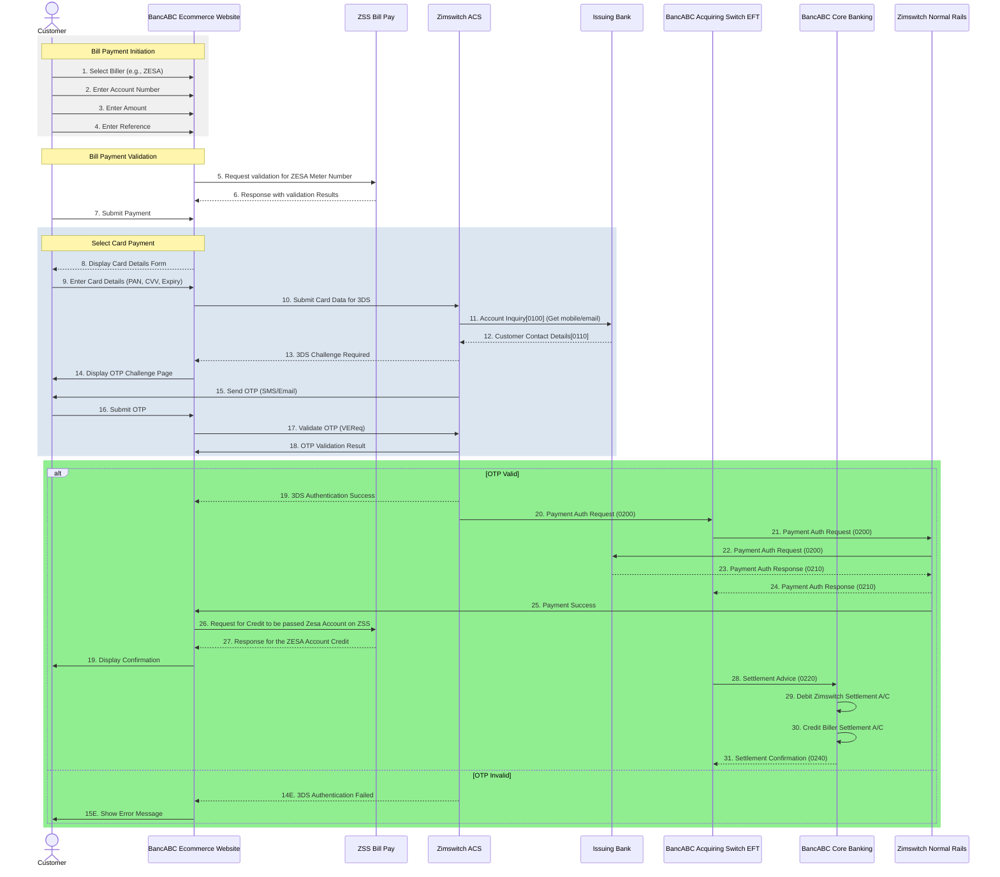

```mermaid
sequenceDiagram
    actor Customer
    participant BancABC_Web as BancABC Ecommerce Website
    participant ZSS as ZSS Bill Pay
    participant ZimACS as Zimswitch ACS
    participant Issuer as Issuing Bank
    participant BancEFT as BancABC Acquiring Switch EFT
    participant BancCore as BancABC Core Banking
    participant ZimNorm as Zimswitch Normal Rails
   
 
    rect rgb(240, 240, 240)
    Note over Customer,BancABC_Web: Bill Payment Initiation
    Customer->>BancABC_Web: 1. Select Biller (e.g., ZESA)
    Customer->>BancABC_Web: 2. Enter Account Number
    Customer->>BancABC_Web: 3. Enter Amount
    Customer->>BancABC_Web: 4. Enter Reference
    end
 
    rect rgb(255, 255, 255)
    Note over Customer,BancABC_Web: Bill Payment Validation
    BancABC_Web->>ZSS: 5. Request validation for ZESA Meter Number
    ZSS-->>BancABC_Web: 6. Response with validation Results
    Customer->>BancABC_Web: 7. Submit Payment
    end
 
    rect rgb(220, 230, 241)
    Note over Customer,BancABC_Web: Select Card Payment
    BancABC_Web-->>Customer: 8. Display Card Details Form
    Customer->>BancABC_Web: 9. Enter Card Details (PAN, CVV, Expiry)
    BancABC_Web->>ZimACS: 10. Submit Card Data for 3DS
    ZimACS->>Issuer: 11. Account Inquiry[0100] (Get mobile/email)
    Issuer-->>ZimACS: 12. Customer Contact Details[0110]
    ZimACS-->>BancABC_Web: 13. 3DS Challenge Required
    BancABC_Web->>Customer: 14. Display OTP Challenge Page
    ZimACS->>Customer: 15. Send OTP (SMS/Email)
    Customer->>BancABC_Web: 16. Submit OTP
    BancABC_Web->>ZimACS: 17. Validate OTP (VEReq)
    ZimACS->>BancABC_Web: 18. OTP Validation Result
    end
 
    rect rgb(144, 238, 144)
    alt OTP Valid
        ZimACS-->>BancABC_Web: 19. 3DS Authentication Success
        ZimACS->>BancEFT: 20. Payment Auth Request (0200)
        BancEFT->>ZimNorm: 21. Payment Auth Request (0200)
        ZimNorm->>Issuer: 22. Payment Auth Request (0200)
        Issuer-->>ZimNorm: 23. Payment Auth Response (0210)
        ZimNorm-->>BancEFT: 24. Payment Auth Response (0210)
        ZimNorm->>BancABC_Web: 25. Payment Success
        BancABC_Web->>ZSS: 26. Request for Credit to be passed Zesa Account on ZSS
        ZSS-->>BancABC_Web: 27. Response for the ZESA Account Credit
        BancABC_Web->>Customer: 19. Display Confirmation
        BancEFT->>BancCore: 28. Settlement Advice (0220)
        BancCore->>BancCore: 29. Debit Zimswitch Settlement A/C
        BancCore->>BancCore: 30. Credit Biller Settlement A/C
        BancCore-->>BancEFT: 31. Settlement Confirmation (0240)    
    else OTP Invalid
        ZimACS-->>BancABC_Web: 14E. 3DS Authentication Failed
        BancABC_Web->>Customer: 15E. Show Error Message
    end
    end
```
